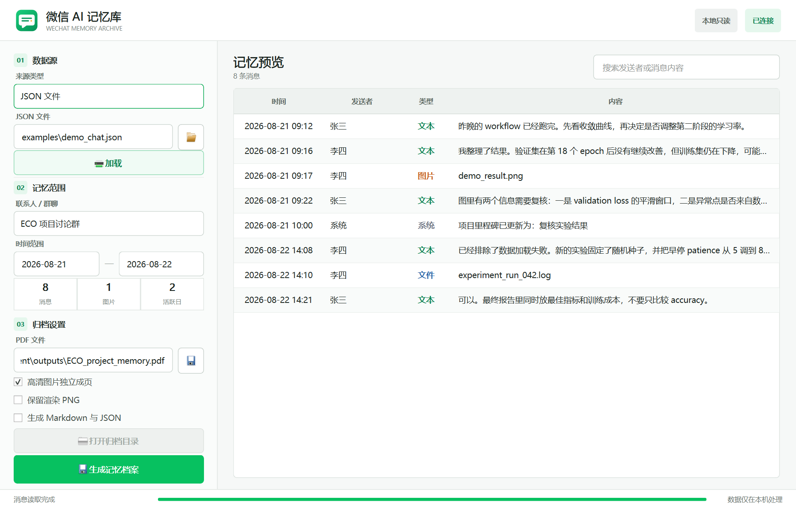

# 微信 AI 记忆库

> WeChat AI Memory · 将本地聊天记录整理为可检索、可归档、可供 AI Agent 阅读的个人记忆资料。



微信 AI 记忆库是一个本地优先的 Windows 桌面应用。它可直接连接本机微信 4.x 数据，按联系人、群聊、日期和关键词整理记忆，并生成 PDF、Markdown 与结构化 JSON。整个过程不上传聊天内容、图片、密钥或导出文件。

当前版本聚焦可靠的数据抽取与归档，为后续语义索引、RAG 和 MCP 查询接口提供稳定的本地数据层；它不会把尚未实现的向量搜索包装成现成功能。

## 核心能力

- 本机微信 4.x：自动检测账户数据目录，只读解密临时副本
- 记忆工作台：选择会话与日期、关键词筛选、消息/图片/活跃日统计
- JSON 备用入口和命令行：适合迁移、测试和批处理
- 文本、图片、文件和系统消息
- 自动分页，并尽量避免把同一条消息切到两页
- 图片缩略图保留上下文，原图另插独立页面
- PDF、Markdown、规范化 JSON 和可选 PNG 页面，适合归档或交给 AI Agent
- 中英文排版、相对图片路径、EXIF 方向修正
- 完全本地处理，无遥测、无远程 API

本机微信读取目前针对已验证的 Windows 微信 4.x 数据格式。连接时程序会重启一次微信，并在启动过程中读取当前账户用于打开数据库的内存密钥；密钥只保留在本进程内存中。微信版本升级可能改变内部格式，因此本机读取与通用的 `ChatSource`、渲染和导出模块相互隔离。

## 快速开始

需要 Windows、微信 4.x 和 Python 3.11 或更高版本。

最简单的启动方式是双击项目根目录中的 `start.cmd`。脚本会使用项目自己的 `.venv-gui`，避免 Conda 环境中的 Qt DLL 冲突。

也可以在 PowerShell 中启动：

```powershell
.\.venv-gui\Scripts\python.exe app.py
```

项目内已存在 `.venv-gui` 时，直接运行 `python app.py` 也会自动切换到该环境，从而避开 Conda 的 Qt DLL 冲突。

首次安装时：

```powershell
py -3 -m venv .venv-gui
.\.venv-gui\Scripts\python.exe -m pip install -e ".[gui,dev]"
```

## Windows 软件包

项目提供 PyInstaller 目录版构建脚本。目录版会保留 Qt、Frida 及其运行库的原始文件结构，启动速度和兼容性比单文件解包模式更稳定：

```powershell
.\scripts\build_windows.ps1
```

构建结果位于 `dist/WeChatAIMemory/`，可分发压缩包位于 `outputs/WeChatAIMemory-Windows-x64.zip`。解压后双击 `WeChatAIMemory.exe` 即可运行，不要求目标电脑安装 Python。

GUI 默认使用“本机微信”：

1. 确认自动检测出的微信账户目录，点击“连接微信”。
2. 程序重启微信后，在 5 分钟内扫码或用手机确认登录。
3. 选择联系人或群聊与日期范围。
4. 若需要原图，点击“读取图片”；程序会从已登录的微信进程读取账户图片配置。旧版微信若无法自动读取，可先打开一张聊天原图再重试。
5. 选择保存位置并点击“生成记忆档案”。

连接和导出都只读原始微信文件；解密后的数据库和图片位于系统临时目录，并在关闭数据源时删除。

## JSON 备用入口

在 GUI 的“类型”中选择“JSON 文件”即可继续使用 v0.1 交换格式。命令行目前也使用这个稳定格式：

命令行导出同一份示例：

```powershell
wechat-context-exporter `
  --source examples/demo_chat.json `
  --conversation eco-project `
  --start 2026-08-21 `
  --end 2026-08-22 `
  --output outputs/demo-context.pdf `
  --pages-dir outputs/demo-pages `
  --markdown outputs/demo-context.md `
  --json outputs/demo-context.json
```

不传 `--conversation` 时会列出 JSON 中的可用会话：

```powershell
wechat-context-exporter --source examples/demo_chat.json
```

## JSON 数据格式

输入文件使用 UTF-8 和 ISO 8601 时间。图片路径可以是绝对路径，也可以相对于 JSON 文件。

```json
{
  "version": 1,
  "conversations": [
    {
      "id": "project-group",
      "name": "项目讨论群",
      "kind": "group",
      "messages": [
        {
          "id": "m001",
          "sender": "张三",
          "timestamp": "2026-08-21T22:15:00",
          "type": "text",
          "content": "workflow 跑得怎么样？"
        },
        {
          "id": "m002",
          "sender": "李四",
          "timestamp": "2026-08-21T22:16:00",
          "type": "image",
          "content": "assets/result.png",
          "is_outgoing": true
        }
      ]
    }
  ]
}
```

字段说明：

| 字段 | 必需 | 说明 |
| --- | --- | --- |
| `version` | 是 | 当前固定为 `1` |
| `conversation.id` | 是 | 会话内稳定唯一标识 |
| `conversation.name` | 是 | 展示名称 |
| `conversation.kind` | 否 | `direct` 或 `group`，默认 `direct` |
| `message.id` | 是 | 文件内全局唯一消息标识 |
| `message.sender` | 是 | 发送者展示名称 |
| `message.timestamp` | 是 | ISO 8601 时间；带时区时转换为本机时间 |
| `message.type` | 否 | `text`、`image`、`file` 或 `system` |
| `message.content` | 是 | 文本内容或本地文件路径 |
| `message.is_outgoing` | 否 | 为 `true` 时在聊天页右侧显示 |
| `message.reply_to` | 否 | 被引用消息的 ID |

## 架构

```text
ChatSource
   |
   v
Conversation + Message[]
   |
   +--> ChatRenderer --> paginated PNG pages
   |
   +--> ImagePageRenderer --> full-page image attachments
   |
   v
ExportService --> PDF + Markdown + JSON
   |
   +--> PySide6 GUI
   +--> CLI
```

微信本地读取和 JSON 读取都实现 `src/wechat_context_exporter/sources/base.py` 中的 `ChatSource` 协议；渲染器和 PDF 导出器不依赖底层数据格式。

## 测试

```powershell
pytest
```

测试覆盖 JSON 校验与日期筛选、多页消息完整性、图片页插入、PDF 页数、数据库密钥派生与页解密、微信 V2 图片解密、本地联系人和消息映射，以及 Markdown/JSON 伴随文件。

## 隐私与边界

- 只处理当前 Windows 用户可访问的本机微信账户数据
- 不上传、不遥测、不调用远程 OCR 或 AI 服务
- 不发送或修改微信消息
- 数据库密钥不写入磁盘，数据库只解密到系统临时目录
- 不绕过账号权限，不用于访问他人的聊天数据

使用者仍需遵守所在地法律法规、微信服务条款以及聊天参与者的隐私权。

## 路线图

- `v0.1`：JSON 渲染闭环、GUI、CLI 和自动化测试
- `v0.2`：Windows 微信 4.x 本机数据适配器、会话选择和 V2 图片恢复
- `v0.3`：AI 记忆库工作台、关键词筛选、范围统计和 GitHub 发布界面
- `v0.4`：引用内容展开、表情与文件预览、图片去重
- `v0.5`：可选 OCR、语义索引、RAG 与 MCP 查询接口

## License

MIT
